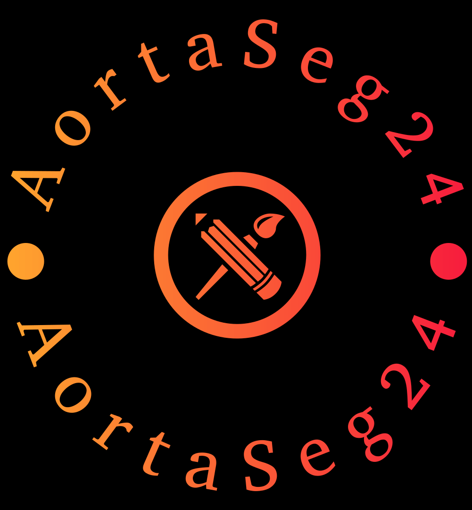
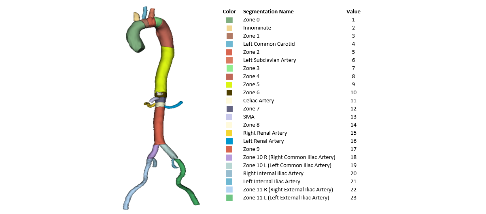

<div align=center> <h1>
  
  Multi-Class Segmentation of Aortic Branches and Zones in Computed Tomography Angiography</h1>

Welcome to the **AortaSeg24** challenge, where innovation meets collaboration in the pursuit of medical imaging excellence.


![mybage](https://img.shields.io/badge/Revolutionize%20Aortic%20Segmentation-sienna?style=flat&logoSize=1000&label=AortaSeg24&labelColor=teal&logo=data:image/png;base64,iVBORw0KGgoAAAANSUhEUgAAABQAAAAUCAYAAACNiR0NAAAAAXNSR0IArs4c6QAAAARnQU1BAACxjwv8YQUAAAAJcEhZcwAADsQAAA7EAZUrDhsAAALBSURBVDhPjZTPaxNBFMffbrLZySbZzSZtfmy2talN2tjSYiNIq2IDtkS8lSIVrYiCIApiD14EEYoH9ewfIKIIPXj3ogiCYAt6lSpaxR/QUmxt021qnrOzabrb3UK/4ZM3896b2Zk3swtUuBeIj8NWKeAZs8PTP09pYYHZG31JZk+kFehRJNaOC35mveSasDlkJY93q8yKfh70kAC/KlWo/KtBT0SCSy0J90CbHEueGkkzq0cEh99ONiiij9pHuRzuF8nOuNUopEQc61PMGmCA1suW4ElJlbGsRlm7XSCo+a36cvUEGO6KgFGtwetPq2Z3z5qIJcCgpXi7ugLzmwZwebqy3gyBn0ub8Oaz92RHkmEQgINXv1fqHqfMekocD3+xBvzXhQ2QiQ9m59esqE3HMmF4f6Yb2iIiJIMCvBjqgnE9Xo9uq0Z5numGEomyPtt7SOSZ3SLo5/DduYJZE4yLfua7WUjj02IO2yXRkeugt4XgaL/iCtwrZdhJ5xURly8U8VpnErMha6Lp/rwrfyio4KAoIz9ZboYnl1upzymO/gI8Bx//GHBr5htMHdRBpH0r5taDpnaYiraxtutpJiGBx5mJAmYj29u726vjs0M57JBcd6+BT5V8d3roKXcmCHxZ3KA+S9UawtySAY+Hs7BqIHRGCIxqMZj+vggvF5brWZbKYRUGiQwfDOuW4NnDURwvWpfUi5IWwRHNXWc75+UEisBeCMC0Yp2iruz+uu3GabUJ+0jI7rMaFwdieGUwbg/sCZHj8H6qbWt1JlYgKHBIKCfzMhY1qTFgNzqCBCc1zeVvfIUqVYR1inkYsz/W4PbRNPMfUAmzpzJRoPcQdBKAq61JmKus02vEw0S8mcXtcj3FZDgrM/vw+D5URR8ONIXxej6FAbrFsVQM/dTuHFPH09kgJVkHpdPPvyz4XHEngP8Bjxlvxv94ZMIAAAAASUVORK5CYII=)

</div>


---

<h2>About the Challenge</h2>

This challenge focuses on proposing deep learning models for the segmentation of the Aorta, its branches, and zones. We provide an [example script](https://github.com/ImranNust/AortaSeg24_Duplicate/tree/main/training) utilizing [SwinUNETR](https://arxiv.org/abs/2201.01266) to guide you in developing your training script and training a module. Additionally, [sample validation code](https://github.com/ImranNust/AortaSeg24_Duplicate/tree/main/validation) is available to assess your proposed model's performance. Finally, a container submission script is offered to facilitate the submission process to the Grand Challenge. Feel free to modify this script to suit your specific needs.

---

<h2><u><center> Dataset Details </center></u></h2>

### Input Image Specifications
- **Type**: 3D CTA Volume
- **Axial Dimensions**: 
  - **Minimum**: $389\times389$ pixels
  - **Maximum**: $516\times516$ pixels
  - **Average**: $450\times450$ pixels
- **Voxel Resolution**: Isotropic, uniformly set to $\(1mm \times 1mm \times 1mm\)$.
- **Axial Slice Count**: 
  - **Range**: 578 to 801 slices
  - **Average**: 695 slices

### Output Segmentation Specifications
The output is a 3D segmentation model mirroring the input image characteristics, with the addition of 23 segmentation classes detailed below.

#### Segmentation Classes



### Accessing the Dataset

<!-- To access the dataset, please participate in the **[AortaSeg24 Challenge](https://aortaseg24.grand-challenge.org/)** hosted on the Grand Challenge platform. Begin by visiting the challenge page and proceed to complete the **[Data Agreement Form](https://aortaseg24.grand-challenge.org/dataset-access-information/)**. Upon submission and approval, you will gain full access to the dataset. -->

The **[AortaSeg24 Challenge](https://aortaseg24.grand-challenge.org/)** has concluded, and the dataset is now openly available to anyone upon completing the Data Use Agreement (DUA) form. To access the dataset, please fill out the **[Data Use Agreement (DUA)](powerforms.docusign.net/1e71cea6-b652-4f89-b1e4-5f72f7cbd3d4?env=na3&acct=38f380cc-7bc9-468e-9c99-fc5ba7151d54&accountId=38f380cc-7bc9-468e-9c99-fc5ba7151d54)** form. Upon submission and approval, you will gain full access to the dataset.

---

<h1><center><u><b>Citation</b></u></center></h1>

**If you utilize our code or dataset in your research, we kindly ask you to acknowledge our work by citing the following publications:**
```bibtex
1. @article{IMRAN2024102470,
    title = {CIS-UNet: Multi-class segmentation of the aorta in computed tomography angiography via context-aware shifted window self-attention},
    author = {Muhammad Imran and Jonathan R. Krebs and Veera Rajasekhar Reddy Gopu and Brian Fazzone and Vishal Balaji Sivaraman and Amarjeet Kumar and Chelsea Viscardi and Robert Evans Heithaus and Benjamin Shickel and Yuyin Zhou and Michol A. Cooper and Wei Shao},
    journal = {Computerized Medical Imaging and Graphics},
    volume = {118},
    pages = {102470},
    year = {2024},
    issn = {0895-6111},
    doi = {https://doi.org/10.1016/j.compmedimag.2024.102470},
    url = {https://www.sciencedirect.com/science/article/pii/S0895611124001472}}

2. @article{KREBS20241025,
    title = {Volumetric analysis of acute uncomplicated type B aortic dissection using an automated deep learning aortic zone segmentation model},
    author = {Jonathan R. Krebs and Muhammad Imran and Brian Fazzone and Chelsea Viscardi and Benjamin Berwick and Griffin Stinson and Evans Heithaus and Gilbert R. Upchurch and Wei Shao and Michol A. Cooper},
    journal = {Journal of Vascular Surgery},
    volume = {80},
    number = {4},
    pages = {1025-1034.e4},
    year = {2024},
    issn = {0741-5214},
    doi = {https://doi.org/10.1016/j.jvs.2024.06.001},
    url = {https://www.sciencedirect.com/science/article/pii/S074152142401245X}}

3. @article{IMRAN2025AORTASEG24,
    title={Multi-Class Segmentation of Aortic Branches and Zones in Computed Tomography Angiography: The AortaSeg24 Challenge},
    author={Muhammad Imran and  Jonathan R Krebs and Vishal Balaji Sivaraman and Teng Zhang and ... and Jun Ma and Yuyin Zhou and Michol A. Cooper and Wei Shao},
    journal={arXiv preprint arXiv:2502.05330},
    year={2025},
    url = {https://arxiv.org/abs/2502.05330}}
